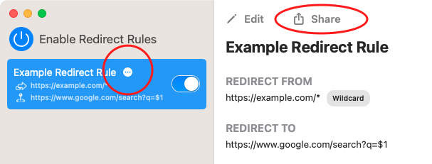
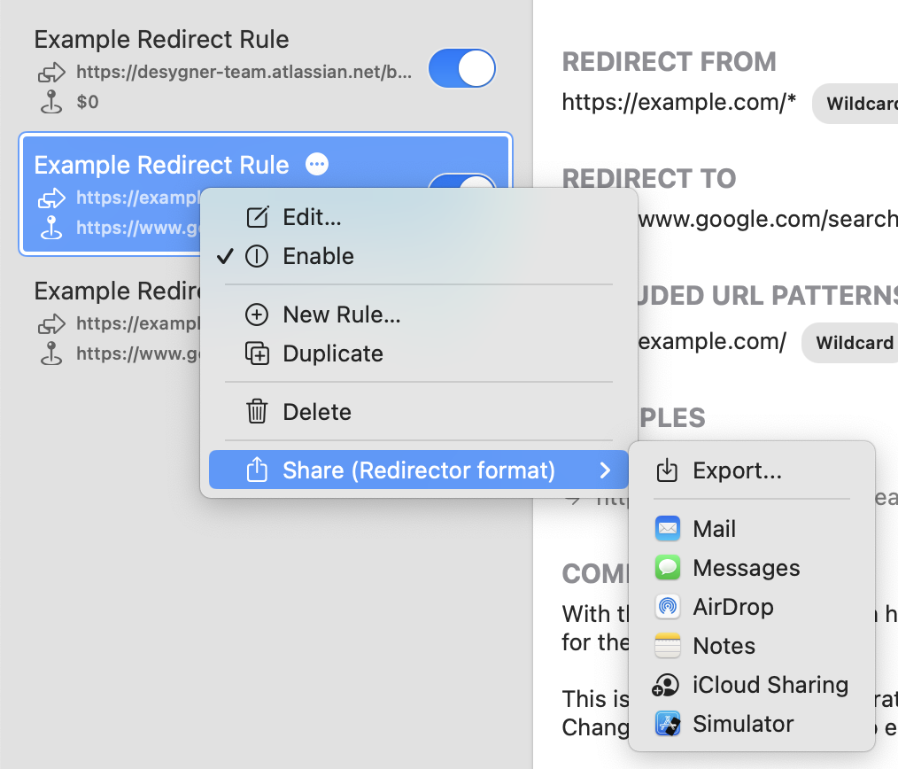
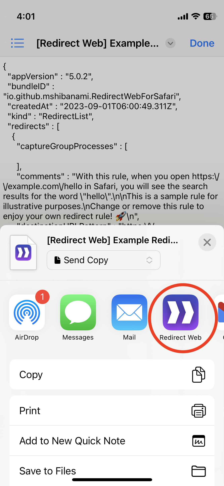

# Export/Import Rules

You can share, back up, or export your rules by selecting "Share" in the app.

## Export Rules

### macOS

Click either the ellipsis button or the Share button as shown in this screenshot:

You can also multi-select the rules and export them by secondary clicking (right-clicking) them on the rule-listing sidebar:

In addition, you can export all the rules by the menubar > File > Export All Redirect Rules:

If you want to export the rules in the format compatible with [Einar Egilsson's Redirector](https://einaregilsson.com/redirector/), press the Option key (`⌥`) on the context menu or the menubar, then you'll see these:

Please note that Redirect Web is not fully compatible with Redirector, and vise versa. Some settings, such as "Replace Occurrences" for Capture Group Processing, aren't exported with the Redirector's format.

### iOS

You can share the rules like this:

<iframe width="560" height="315" src="https://www.youtube.com/embed/uQ6-SLEMlT4" title="YouTube video player" frameborder="0" allow="accelerometer; autoplay; clipboard-write; encrypted-media; gyroscope; picture-in-picture; web-share" allowfullscreen></iframe>

## Import Rules

### macOS

- Simply drag and drop the exported rule files to Redirect Web's window.
- Or, you can also import them from the menubar > File > Import Redirect Rules

### iOS

Suppose your rules file is in the Files app. Open it and then tap the Share button, and then select Redirect Web:

| Step 1: Tap the Share button on Files | Step 2: Select Redirect Web |
|-|-|
|  |  |
